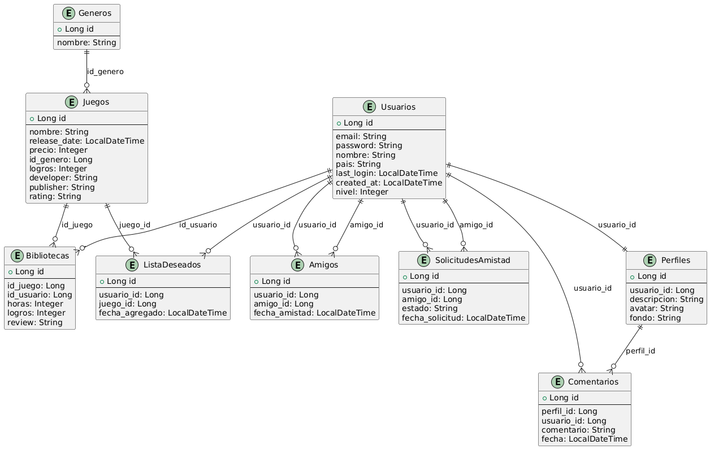

> [!IMPORTANT]  
> 3.0.0 desarrollandose activamente en `develop/agus`

## Desarrollo de 3.0.0:

Tablas Nuevas: _Perfiles, Comentarios, Amigos, SolicitudesAmistad, ListaDeseados_

### //TODOs 3.0.0

1. Agregar Billetera
2. Comprar Juegos
3. Mejorar Reseñas (Positivas/Negativas)
4. Listado de juegos con su porcentaje de reseñas positivas
> // TODOs despues de agregar las tablas nuevas `[Perfil]` `[Comentarios]` `[Amigos]` `[SolicitudesAmistad]` `[ListaDeseos]`
5. Listar amigos de un usuario
6. Listar amigos que compraron `X` juego
7. Enviar Solicitud de Amistad
8. Ver Solicitudes
9. Aceptar/Rechazar Solicitud
10. Agregar juego a lista de deseados
11. Quitar juego de la lista de deseados

# Release History

**v1.0.0**

***Bibliotecas y Usuarios***

_"Endpoints Basicos"_

Usuario
-------
- /login/ `POST`

Juegos
------
- /juegos/{nombre} `GET`
- /juegos/genero/{genero} `GET`
- /juegos/buscar/{palabra} `GET`

Biblioteca
----------
- /biblioteca/{horas} `GET`

----------

**v2.0.0**

***Analiticas Extendidas de Juegos y Usuarios***

> [!NOTE]  
> Análisis y listados detallados de juegos y usuarios.

1. Buscar juegos que contengan _palabra_. `/juegos/buscar/{palabra}`

2. Listar juegos por cantidad de reviews. `/juegos/visualizar-por/reviews`

3. Listar juegos con mayor cantidad de horas totales. `/juegos/visualizar-por/horas`

4. Listar juegos mas comprados. `/juegos/visualizar-por/descargas`

5. Listar usuarios con la mayor cantidad de juegos comprados. `/usuarios/juegos`

6. Listar usuarios por mayor cantidad de horas registradas en juegos. `/usuarios/horasTotales`

7. Listar usuarios que hayan jugado comprado _nombre del juego_. `/usuarios/compraron/{juego}`

8. Listar usuarios con la mayor cantidad total de logros obtenidos. `/usuarios/logros`

9. Listar usuarios por nivel mayor a menor. `/usuarios/top-level`

10. Listar todos los usuarios por ultima vez conectado. `/usuarios/recientes`

11. Listar todos los usuarios empezando por el mas antiguo. `/usuarios/antiguedad`
